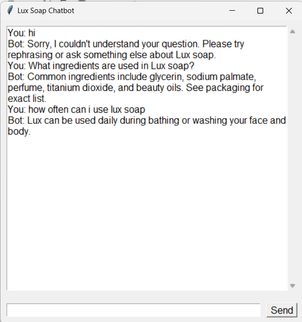

# Lux Soap FAQ Chatbot

A simple Python chatbot application that answers frequently asked questions about **Lux soap**.  
It uses Natural Language Processing (NLP) techniques like TF-IDF vectorization and cosine similarity to find the best matching FAQ answer.  
The chatbot runs with a graphical user interface (GUI) built using Tkinter.

---

## Features

- Preprocesses user queries using tokenization, lemmatization, and stopword removal with NLTK
- Converts questions and user input into TF-IDF vectors for comparison
- Finds the closest matching question from a pre-defined FAQ dataset using cosine similarity
- Provides an easy-to-use Tkinter GUI for chatting

---

## Requirements

- Python 3.7 or higher  
- Required Python libraries:
  - `nltk`
  - `scikit-learn`
  - `numpy`

---

## Installation

1. Clone this repository or download the source code.
2. Install the required packages using pip:

   ```bash
   pip install nltk scikit-learn numpy

## How It Works
- The user input is preprocessed (lowercased, tokenized, lemmatized, and filtered for stopwords).
- The chatbot converts the user input into a TF-IDF vector.
- It calculates cosine similarity between the user input vector and all preprocessed FAQ questions.
- It returns the answer corresponding to the closest matching FAQ question if the similarity is above a threshold (0.3).
- If no good match is found, the chatbot asks the user to rephrase their question.

## FAQ Dataset
The chatbot’s knowledge base is stored as a Python dictionary inside the script. It contains common questions and answers about Lux soap, including product details, ingredients, benefits, usage, availability, and more.
You can extend or modify the dataset easily by editing the faq_data dictionary.

## Screenshot


## Acknowledgments
- NLTK for natural language processing tools
- scikit-learn for TF-IDF vectorization and similarity metrics
- Tkinter for the GUI interface

## Contributing
Feel free to submit issues or pull requests if you want to improve or extend this chatbot!
